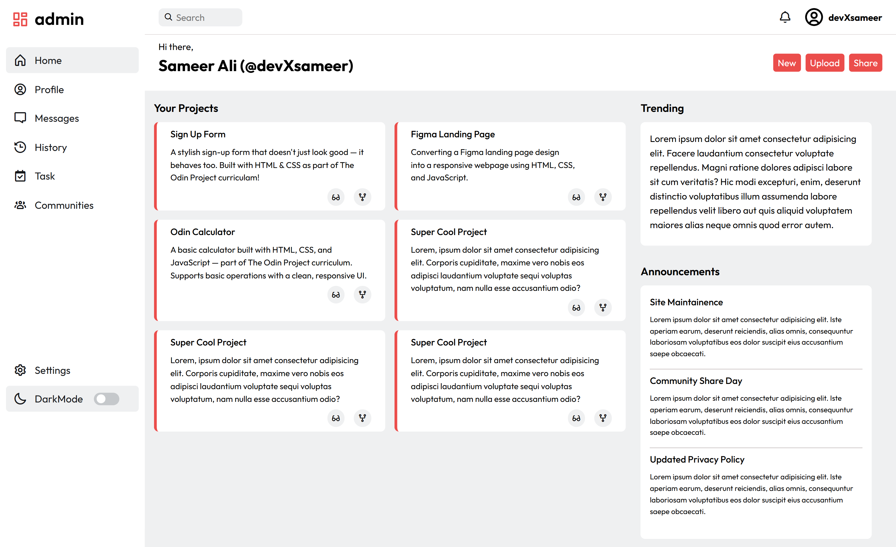
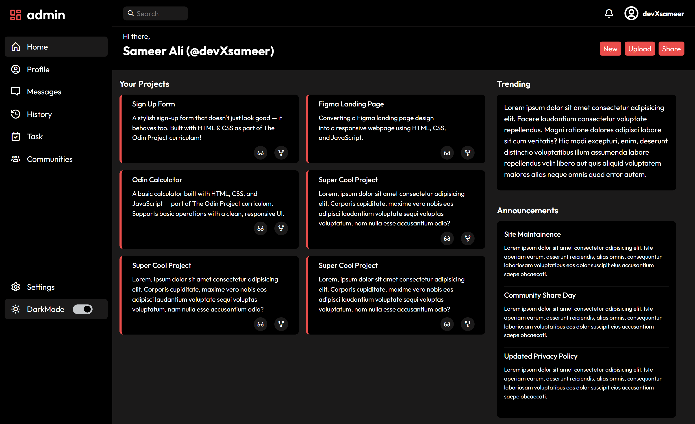

# 🧱 Admin Dashboard (CSS Practice Project)

A fully responsive **admin dashboard UI** built with **HTML** and **CSS** [A little JS], designed to sharpen my layout and styling skills using **CSS Grid**, **Flexbox**, and... a touch of darkness 🌙 (yes, there's a dark mode).

This project is part of my #100DaysOfCode challenge and The Odin Project curriculum.

---

## 🚀 Live Demo

🌐 [View it live](https://devxsameer.github.io/admin-dashboard/)  
📦 [GitHub Repo](https://github.com/devxsameer/admin-dashboard)

---

## 📸 Preview

"A dashboard that manages nothing — except my layout anxiety"

#### `Light Mode:`

#### `Dark Mode:`

## 

## 🎯 Features

- 📐 **Responsive layout** using CSS Grid and Flexbox
- 🧱 Sidebar, navbar, main content, cards and sections
- 🌗 **Dark mode toggle** for those who code best in the shadows
- 🎨 Custom styling with CSS variables for easy theme control
- 📱 Fully responsive design — works great on all screen sizes

---

## 🛠️ Built With

- **HTML5**
- **CSS3**
  - Grid & Flexbox
  - CSS custom properties (variables)
  - Dark mode via class toggling
  - Transitions, shadows, spacing, and layout management

---

## 🧠 What I Learned

- Structuring complex interfaces using **CSS Grid** and **Flexbox**
- Managing nested layouts responsively
- Creating modular, reusable UI components
- Implementing **dark/light theme switching** with clean CSS

---

## 🙌 Credits

Built as part of the [The Odin Project](https://www.theodinproject.com/) Full Stack JS course.

---

## 🔖 Related

- Logged under **Day 32-33** of my [#100DaysOfCode](https://github.com/devxsameer/100-days-of-code)
- Built completely from scratch — no frameworks, just good ol’ HTML + CSS + Little JS

---

## 💬 Final Words

Dark mode makes everything look more professional.  
Except my sleep schedule. 😴

#100DaysOfCode #CSS #AdminDashboard #DarkMode #TheOdinProject #WebDevelopment #Frontend #CSSLayout
